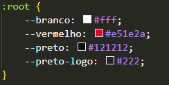
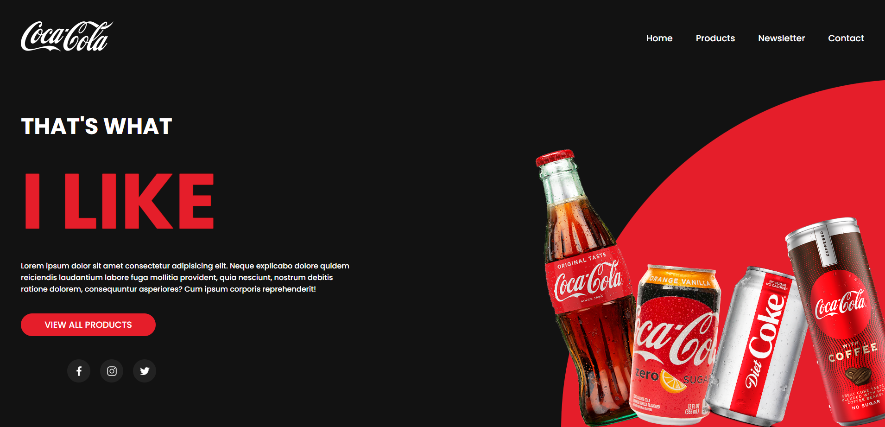

# :triangular_ruler: Landing-Page Coca-Cola
* Projeto Landing-Page Coca-Cola

# :memo: Índice
* [:chart_with_upwards_trend: Proposta](https://github.com/rodrigobarros2802/landing-page-coca#chart_with_upwards_trend-proposta)
* [:trophy: Desafio](https://github.com/rodrigobarros2802/landing-page-coca/edit/master/README.md#trophy-desafio)
* [:hammer_and_wrench: Tecnologias](https://github.com/rodrigobarros2802/landing-page-coca/edit/master/README.md#hammer_and_wrench-tecnologias)
* [:dart: Objetivo](https://github.com/rodrigobarros2802/landing-page-coca/edit/master/README.md#dart-objetivo)
* [:open_book: Aprendizado](https://github.com/rodrigobarros2802/landing-page-coca/edit/master/README.md#open_book-aprendizado)
* [:camera: Imagens do Projeto](https://github.com/rodrigobarros2802/landing-page-coca/edit/master/README.md#camera-imagens-do-projeto)
* [:link: Links](https://github.com/rodrigobarros2802/landing-page-coca/edit/master/README.md#link-links)
* [:technologist: Autor](https://github.com/rodrigobarros2802/landing-page-coca/edit/master/README.md#technologist-autor)

# :chart_with_upwards_trend: Proposta
* Projeto proposto para melhorar e praticar CSS utilizando novas propriedades
* Enriquecer o portfólio

# :trophy: Desafio
* Maior desafio foi conseguir usar as propriedades que nunca tinha usado antes como Transition, Translate alterando os eixos X e Y, filter alterando a cor da logo.

# :hammer_and_wrench: Tecnologias
* HTML5
* CSS3

# :dart: Objetivo
* O principal objetivo de desenvolver esse projeto, foi trabalhar a estilização com CSS, usar propriedades diferentes como Transform, Transition, Filter, Clip-Path.

# :open_book: Aprendizado
* Neste projeto eu aprendi a otimizar mais o tempo e a manutenção da página usando variáveis, assim tornando mais prático e ágil quando se faz necessário de alguma alteração.

# :camera: Imagens do Projeto

# :link: Links
* **Link GitHub Pages** - https://rodrigobarros2802.github.io/landing-page-coca/

# :technologist: Autor
* **Repositório GitHub** - https://github.com/rodrigobarros2802/
* **LinkedIn** - https://www.linkedin.com/in/rodrigobarros2802/

